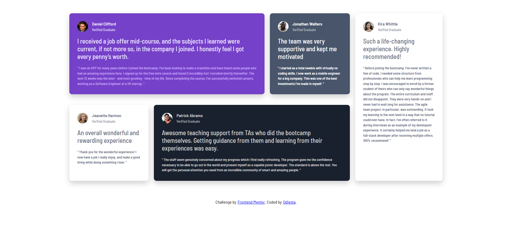

# Frontend Mentor - Testimonials grid section solution

This is a solution to the [Testimonials grid section challenge on Frontend Mentor](https://www.frontendmentor.io/challenges/testimonials-grid-section-Nnw6J7Un7). Frontend Mentor challenges help you improve your coding skills by building realistic projects.

## Table of contents

- [Frontend Mentor - Testimonials grid section solution](#frontend-mentor---testimonials-grid-section-solution)
  - [Table of contents](#table-of-contents)
  - [Overview](#overview)
    - [The challenge](#the-challenge)
    - [Screenshot](#screenshot)
    - [Links](#links)
  - [My process](#my-process)
    - [Built with](#built-with)
    - [What I learned](#what-i-learned)
    - [Continued development](#continued-development)
    - [Useful resources](#useful-resources)
    - [AI Collaboration](#ai-collaboration)
  - [Author](#author)

**Note: Delete this note and update the table of contents based on what sections you keep.**

## Overview

### The challenge

Users should be able to:

- View the optimal layout for the site depending on their device's screen size

### Screenshot



### Links

- Solution URL: [Github](https://github.com/Odiesta/testimonials-grid-section)
- Live Site URL: [Netlify](https://polite-kashata-0255b8.netlify.app/)

## My process

### Built with

- Semantic HTML5 markup
- CSS custom properties
- Flexbox
- CSS Grid
- Mobile-first workflow

### What I learned

I reinforced my understanding of **CSS Grid** — specifically using `grid-template-areas` to create a complex, asymmetric layout. I used a mobile-first approach with two breakpoints: a 2-column grid at 768px, and the full 5-card design at 1024px.

One thing I practiced was using named grid areas:

```css
@media screen and (min-width: 1024px) {
  .container {
    display: grid;
    grid-template-areas:
      "daniel daniel daniel daniel jonathan kira"
      "jeanette patrick patrick patrick patrick kira";
  }

  #daniel {
    grid-area: daniel;
  }
  #jonathan {
    grid-area: jonathan;
  }
  #jeanette {
    grid-area: jeanette;
  }
  #patrick {
    grid-area: patrick;
  }
  #kira {
    grid-area: kira;
  }
}
```

I also got more comfortable with CSS custom properties for keeping colors consistent across light and dark card styles.

### Continued development

I want to keep practicing responsive grid layouts — especially handling more complex grid placements with overlapping or varying column/row spans.

### Useful resources

- [CSS Grid Garden](https://cssgridgarden.com/) - A fun game that helped me understand grid properties intuitively.
- [CSS-Tricks: A Complete Guide to Grid](https://css-tricks.com/snippets/css/complete-guide-grid/) - My go-to reference whenever I need a refresher on grid syntax.

### AI Collaboration

I use Github Copilot with Deepseek API for asking question. The price for asking question is very low.

## Author

- Frontend Mentor - [@Odiesta](https://www.frontendmentor.io/profile/Odiesta)
- Twitter - [@OdiestaS](https://www.x.com/OdiestaS)
